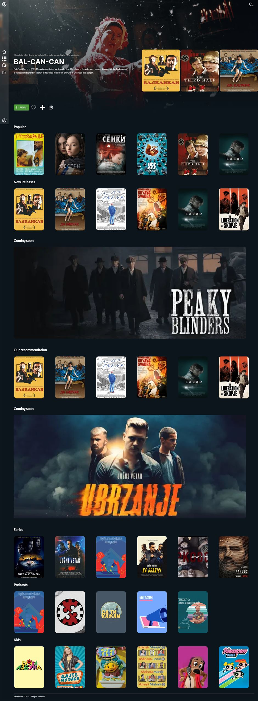

# KinoMoe

## About

### Purpose

The website serves as an online streaming platform that allows users to
explore, engage with, and express themselves through a wide variety of media
content including (but not limited to) Movies, TV series, documentaries, and
podcasts.

### Vision for the platform

To become the leading hub for entertainment and
cultural content, recognized both locally and internationally. It aspires to bridge
cultural gaps and promote understanding by highlighting the unique aspects of
life, history, and contemporary society in this region. The vision extends to being
a pioneer in adopting new technologies like VR/AR to offer immersive and
innovative viewing experiences.

### Mission Statement

The mission of “Kinemoe” streaming platform is to showcase
the richness of Macedonian, Balkan, European and Mediterranean culture, as well
as be a platform that houses creativity through a diverse range of audiovisual
content. It aims to provide a dedicated space for all filmmakers, artists, and
creators to display their work, both to a national audience and to viewers
worldwide.

## Screenshot



## Live Preview - [KINE-MOE](https://kino-moe.vercel.app/)

## Tech Stack

- **[NextJS ](https://nextjs.org/)**
- **[ SASS](https://sass-lang.com/)**
- **[ NextAuth.js](https://next-auth.js.org/)**
- **[ Supabase](https://supabase.com/)**
- **[ Prisma](https://www.prisma.io/)**
- **[ Framer Motion](https://www.framer.com/motion/)**
- **[ Swiper](https://swiperjs.com/)**
- **[ ZUSTAND](https://zustand-demo.pmnd.rs/)**

## Run Locally

Clone the project

```bash
  git clone https://git.brainster.co/Vlatko.Jakimoski-FE15/brainsterchallenges_vlatkojakimoski_fe15.git
```

Go to the project directory

```bash
  cd my-project
```

Install dependencies

```bash
  npm install
```

Supabase Setup

The Supabase project is already set up with the necessary configurations. You can find instructions in .copy.env file

Prisma Setup

```bash
npx prisma generate
npx prisma migrate dev --name init
```

Start the app locally

```bash
  npm run dev
  npm start server
```

Build

```bash
  npm run build
```

## Pages

### Landing Page

```javascript
      <LandingHeaderComponent />
      <main className="page">
        <LandingMoviesGroup />
        <section className="landing-artist">
          <h2 className="landing-artist__title">Meet the artists</h2>
          <div className="landing-artist__wrapper">
            <LandingArtistSlider />
          </div>
        </section>
        <MovieBannerComponent
          background={true}
          imgSrc={BannerImg}
          alt="banner"
        />
        <PricingComponent />
      </main>
      <LandingFooter />
```

### Sign in

```javascript
<section className="auth-layout__wrapper">
  <div className="auth-layout__left">
    <Image
      className="auth-layout__logo"
      width={280}
      height={60}
      src={logo}
      alt="logo"
      sizes="280px"
    ></Image>
    <Image
      className="auth-layout_background"
      src={background}
      alt="new"
      style={{ width: "100%", height: "100%" }}
      sizes="(min-width: 1040px) 40vw, 45vw"
      fill
    ></Image>
  </div>
  <div className="auth-layout__right">
    <SignInComponent />
  </div>
</section>
```

### Sign Up

```javascript
<section className="auth-layout__wrapper">
  <div className="auth-layout__left">
    <Image
      className="auth-layout__logo"
      width={280}
      height={60}
      src={logo}
      alt="logo"
      sizes="280px"
    ></Image>
    <Image
      className="auth-layout_background"
      src={background}
      alt="new"
      style={{ width: "100%", height: "100%" }}
      sizes="(min-width: 1040px) 40vw, 45vw"
      fill
    ></Image>
  </div>
  <div className="auth-layout__right">
    <SignUpComponent />
  </div>
</section>
```

### Home Page

```javascript
    <MovieHeaderComponent />
        <main className="main-page">
            <MovieSliderComponent title="Popular" content={popularMovies} />
            <MovieSliderComponent title="New Releases" content={newMovies} />
            <MovieBannerComponent
            imgSrc={bannersGroupMovies[1].imageSrc}
            alt={bannersGroupMovies[1].title}
            title="Coming soon"
            background={false}
            />
            <MovieSliderComponent title="Our recommendation" content={movies} />
            <MovieBannerComponent
            imgSrc={bannersGroupMovies[2].imageSrc}
            alt={bannersGroupMovies[2].title}
            title="Coming soon"
            background={false}
            />
            <MovieSliderComponent title="Series" content={series} />
            <MovieSliderComponent title="Podcasts" content={podcasts} />
            <MovieSliderComponent title="Kids" content={kidsMovies} />
        </main>
```

### Movies

```javascript
   <MovieHeaderComponent title="Movies Room" categories={categories} />
      <main className="main-page">
        <MovieSliderComponent title="Popular" content={movies} />
        <MovieSliderComponent title="Action" content={series} />
        <MovieSliderComponent title="Comedy" content={movies} />
        <MovieSliderComponent title="Horror" content={movies} />
        <MovieSliderComponent title="Drama" content={kidsMovies} />
        <MovieSliderComponent title="History" content={kidsMovies} />
        <MainButtonComponent>Show more</MainButtonComponent>
      </main>
```

### Watch Page

```javascript
<VideoPlayer />
```

### Community Page

```javascript
<main className="main-page">
  <h1 className="community-page__title">Community</h1>
  <section className="community-page">
    <div className="community-page__buttons">
      <CommunitySearch />
    </div>
    <div className="community-page__post">
      <PostAccordion posts={posts} />
      <div className="community-page__show-more">
        {postsLength > 9 && <ShowMoreBtn initialShowMore={20} />}
      </div>
    </div>
    <div className="community-page__stats">
      <Chart title="Community" percentage={80} total="525" direction="row" />
      <Chart
        title="Discussions"
        percentage={10}
        total={postsLength.toString()}
        direction="row"
      />
      <p>Latest Comments:</p>
      {newPosts.map((post) => (
        <SmallCommentComponent
          key={post.id}
          username={post.user.userName ? post.user.userName : post.user.email}
          text={post.title}
          image={post.user.image ? post.user.image : ""}
        />
      ))}
    </div>
  </section>
</main>
```

### User profile page

```javascript
 <main>
      <section className="profile-page">
        <div className="profile-page__header"></div>
        <div className="profile-page__wrapper">
          <div className="profile-page__profile">
            <ProfileAvatar
              email={user?.email}
              userName={user?.userName}
              accountType={user?.type}
              image={user?.image}
              bio={user?.bio}
            />
          </div>
          <div className="profile-page__info">
            <div className="profile-page__buttons">
              <MainButtonComponent
                customStyles="btn--icon"
                logo={likeIcon}
                alt="like-icon"
              ></MainButtonComponent>
              <MainButtonComponent
                customStyles="btn--icon"
                logo={adicon}
                alt="add-icon"
              ></MainButtonComponent>
              <MainButtonComponent
                customStyles="btn--icon"
                logo={shareIcon}
                alt="share-icon"
              ></MainButtonComponent>
            </div>
            <div>
              <h4>
                Comments by {user?.userName ? user.userName : user?.email}:
              </h4>
              {lastTwoComments?.map((comment) => {
                return (
                  <div key={comment.id} className="profile-page__comments">
                    <div className="profile-page__comments__user">
                      <Image
                        src={user?.image ? user.image : profileImage}
                        width={50}
                        height={50}
                        alt={
                          user?.userName
                            ? user.userName
                            : (user?.email as string)
                        }
                        sizes="100vw"
                      ></Image>
                      <p className="profile-page__comments__username">
                        {user?.userName ? user.userName : user?.email}:
                      </p>
                    </div>
                    <div>
                      <p className="profile-page__comments__body">
                        {comment.body}
                      </p>
                    </div>
                  </div>
                );
              })}
            </div>
            <div className="profile-page__movies">
              <h3>What {user?.userName} watched:</h3>
              <MovieSliderComponent content={movies} />
            </div>
          </div>
        </div>
      </section>
    </main>
```

## Main Components

### Navbar

```javascript
<nav className="main-nav">
  <div className="main-nav__avatar">
    <Link href={"/profile"}>
      <Avatar image={profileImg ? profileImg : ""} />
    </Link>
  </div>
  <ul className="main-nav__list">
    <li className="main-nav__list__item">
      <Link href={"/home"}>
        <Image
          src={Home}
          width={IMAGE_WIDTH}
          height={IMAGE_HEIGHT}
          alt="home-icon"
        ></Image>{" "}
      </Link>
    </li>
    <li className="main-nav__list__item">
      <Image
        onClick={showRooms}
        src={Squares}
        width={IMAGE_WIDTH}
        height={IMAGE_HEIGHT}
        alt="rooms-icon"
      ></Image>
      <ul
        className={`main-nav__sub-list ${active && "main-nav__sub-list--show"}`}
      >
        <li>
          <Link href={"/movies-room"}>
            <Image
              src={MoviesIcon}
              width={IMAGE_WIDTH}
              height={IMAGE_HEIGHT}
              alt="rooms-icon"
              style={{ width: "100%", height: "100%" }}
            ></Image>{" "}
          </Link>
        </li>
        <li>
          <Link href={"/series-room"}>
            <Image
              src={SeriesIcon}
              width={IMAGE_WIDTH}
              height={IMAGE_HEIGHT}
              alt="rooms-icon"
              style={{ width: "100%", height: "100%" }}
            ></Image>
          </Link>
        </li>
        <li>
          <Link href={"/podcasts"}>
            <Image
              src={PodcastIcon}
              width={IMAGE_WIDTH}
              height={IMAGE_HEIGHT}
              alt="rooms-icon"
              style={{ width: "100%", height: "100%" }}
            ></Image>
          </Link>
        </li>
        <li>
          <Link href={"/kids-room"}>
            <Image
              src={KidsIcon}
              width={IMAGE_WIDTH}
              height={IMAGE_HEIGHT}
              alt="rooms-icon"
              style={{ width: "100%", height: "100%" }}
            ></Image>{" "}
          </Link>
        </li>
      </ul>
    </li>
    <li className="main-nav__list__item">
      <Link href={"/community"}>
        <Image
          src={ChatIcon}
          width={IMAGE_WIDTH}
          height={IMAGE_HEIGHT}
          alt="chat-icon"
        ></Image>{" "}
      </Link>
    </li>
    <li className="main-nav__list__item">
      <Image
        src={CameraIcon}
        width={IMAGE_WIDTH}
        height={IMAGE_HEIGHT}
        alt="camera-icon"
      ></Image>
    </li>
  </ul>
  <Image
    src={SettingsIcon}
    width={IMAGE_WIDTH}
    height={IMAGE_HEIGHT}
    alt="home-icon"
  ></Image>
</nav>
```

### ArtistCardComponent

```javascript
<div id="artist-card" className="artist-card">
  {name ? <h3 className="artist-card__title">{name}</h3> : null}
  <div className="artist-card__image">
    <Image
      src={imgSrc}
      alt="name"
      width={IMAGE_WIDTH}
      height={IMAGE_HEIGHT}
      sizes="(max-width: 600px) 100vw, (max-width: 1200px) 50vw, 25vw"
      style={{ width: "100%", height: "100%" }}
    ></Image>
  </div>
</div>
```

### MovieCardComponent

```javascript
<div className="movies-card">
  <Image
    onClick={() => setShowModal(true)}
    className="movies-card__image"
    src={movie.posterImage}
    alt={movie.title}
    width={IMAGE_WIDTH}
    height={IMAGE_HEIGHT}
    sizes="(max-width: 600px) 100vw, (max-width: 1200px) 50vw, 25vw"
    style={{ objectFit: "fill" }}
  />
  <h1 className="movies-card__title">{movie.title}</h1>

  {showModal &&
    createPortal(
      <Modal onClose={() => setShowModal(false)}>
        <ContentPreview movie={movie} />
      </Modal>,
      document.body
    )}
</div>
```

### ButtonComponent

```javascript
<button onClick={handler} className={`btn ${customStyles}`} {...rest}>
      {logo && (
        <Image
          width={24}
          height={24}
          className="btn__logo"
          src={logo}
          alt={alt as string}
        />
      )}
      <span className="btn__children">{children}</span>
      {rightLogo && (
        <Image
          width={24}
          height={24}
          className="btn__logo--right"
          src={rightLogo}
          alt={alt as string}
        />
      )}
    </button>
```

### PricingComponent

```javascript
<section className="pricing-wrapper">
  <div className="pricing-card">
    <div className="pricing-card__header">
      <span>Watch with ads</span>
    </div>
    <div className="pricing-card__content">
      <div className="pricing-card__title">
        <span>Free</span>
      </div>
      <ul className="pricing-card__list">
        <li>Access to a Vast Library</li>
        <li>Unlimited Streaming </li>
        <li>Multiple Devices</li>
        <li>No Subscription Fee</li>
      </ul>
    </div>
    <MainButtonComponent
      handler={handleFreeSubscription}
      customStyles={"btn--sm"}
    >
      Register
    </MainButtonComponent>
  </div>
  <div className="pricing-card pricing-card--target">
    <div className="pricing-card__header">
      <span>Pay to watch</span>
    </div>
    <div className="pricing-card__content">
      <div className="pricing-card__title">
        <span>499den./month</span>
      </div>
      <ul className="pricing-card__list">
        <li>Access to a Vast Library</li>
        <li>Unlimited Streaming </li>
        <li>Multiple Devices</li>
        <li>Watch without ads</li>
        <li>Offline Viewing</li>
      </ul>
    </div>
    <MainButtonComponent
      handler={handlePaidSubscription}
      customStyles={"btn--sm"}
    >
      Register
    </MainButtonComponent>
  </div>
  <div className="pricing-card">
    <div className="pricing-card__header">
      <span>Engage and receive points</span>
    </div>
    <div className="pricing-card__content">
      <div className="pricing-card__title">
        <span>Watch with points</span>
      </div>
      <ul className="pricing-card__list">
        <li>Earn points when you engage</li>
        <li>Claim rewards with earned points</li>
        <li>No Subscription Fee</li>
      </ul>
    </div>
    <MainButtonComponent
      handler={handlePointsSubscription}
      customStyles={"btn--sm"}
    >
      Register
    </MainButtonComponent>
  </div>
</section>
```

### ModalComponent

```javascript
return createPortal(
  <section className={"modal-overlay"}>
    <div className={"modal-overlay"} onClick={() => onClose()}></div>
    <div className="modal">
      <div className="modal__wrapper">
        <button className="modal__close-btn" onClick={() => onClose()}>
          <Image
            src={ExitIcon}
            alt="exit icon"
            width={40}
            height={36}
            sizes="100vw"
            style={{ objectFit: "cover" }}
          />
        </button>
        {children}
      </div>
    </div>
  </section>,
  document.body
);
```

### SignInComponent

```javascript
<div className="login-form">
  <Image
    className="login-form__logo"
    width={IMAGE_WIDTH}
    height={IMAGE_HEIGHT}
    src={logo}
    alt="logo"
  ></Image>
  <h3>Welcome!</h3>
  <p>Join us!</p>
  <form noValidate className="form" onSubmit={handleSignIn}>
    <Input
      label={"Email address"}
      value={email}
      error={emailError}
      type={"email"}
      id={"email"}
      changeHandler={setEmail}
    ></Input>
    <Input
      label={"Password"}
      value={password}
      error={passwordError}
      type={"password"}
      id={"password"}
      changeHandler={setPassword}
    ></Input>

    <MainButtonComponent type="submit" customStyles="btn--form  ">
      Sign In
    </MainButtonComponent>
  </form>

  <div className="login-form__social">
    <p className="form__divider"></p>
    <MainButtonComponent
      handler={googleSignInHandler}
      customStyles="btn--social"
      logo={GoogleLogo}
      alt="Google Logo"
    >
      Sign Up with Google
    </MainButtonComponent>
    <MainButtonComponent
      customStyles="btn--social"
      logo={FacebookLogo}
      alt="Google Logo"
      onClick={handleSignUpWithFacebook}
    >
      Sign Up with Facebook
    </MainButtonComponent>
  </div>

  <Link className="login-form__link" href="/sign-up">
    Create a new account
  </Link>
</div>
```

### PlayerComponent

```javascript
<div className="video-player">
  <div
    onDoubleClick={goFullScreen}
    ref={videoWrapper}
    className="video-player__wrapper"
  >
    <button
      ref={backBtn}
      className="video-player__back-btn"
      onClick={() => router.back()}
    >
      <Image src={backIcon} width={50} height={50} alt="back-button" />
    </button>
    <button ref={infoBtn} className="video-player__info-btn">
      <Image src={infoIcon} width={50} height={50} alt="back-button" />
    </button>
    <video
      className="video-player__player"
      ref={videoRef}
      width="100%"
      autoPlay={true}
    >
      <source src="/assets/videos/ThebestofBalcan.mp4" />
    </video>
    {/* Controls */}
    <div ref={controlsRef} className="video-player__main-controls-wrapper">
      {/* Video Seek Controls */}
      <PlayerSeekComponent
        videoRef={videoRef}
        currentTime={currentTime}
        progressHandler={progressHandler}
      />
      <div className="video-player__bottom-controls-wrapper">
        {/* Time */}
        <div className="video-player__time">
          <p>
            {formatSeconds(currentTime)} /{" "}
            {formatSeconds(videoRef?.current?.duration)}
          </p>
        </div>
        {/* Play controls */}
        <PlayControlsComponent
          playVideoHandler={playPause}
          videoIsPlaying={videoIsPlaying}
          rewindHandler={rewindHandler}
        />
        {/* Settings controls */}
        <div className="video-player__settings">
          <PlayerButtonComponent alt="settings-icon" icon={SettingsIcon} />
          <PlayerButtonComponent alt="subtitles-icon" icon={SubtitlesIcon} />
          <PlayerButtonComponent
            handler={goFullScreen}
            alt="fullscreen-icon"
            icon={fullScreen ? ExitFullIcon : FullScreenIcon}
          />
          <PLayerVolumeComponent
            handleMute={handleMute}
            muted={muted}
            volume={volume}
            handleVolumeChange={handleVolumeChange}
          />
          {/* Comments  */}
          <PlayerCommentsComponent videoRef={videoRef} comments={comments} />
        </div>
      </div>
    </div>
  </div>
</div>
```
